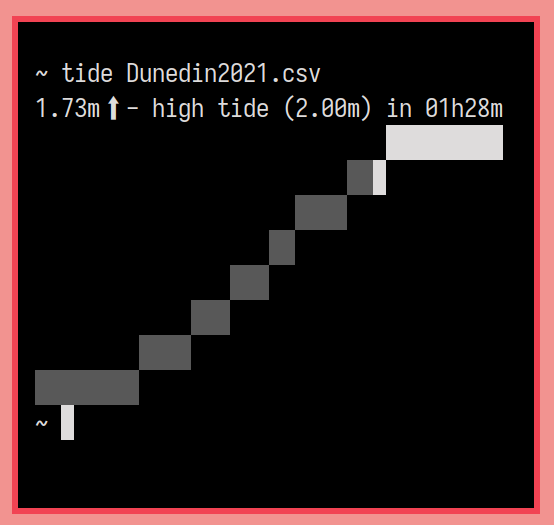

# Tide 

Print Aotearoa's tidal data. Reads csv files from [the official LINZ tide predictions](https://www.linz.govt.nz/sea/tides/tide-predictions).

Tide will print a simpler message without the graph if not running in an
interactive terminal (for example if run as a notification or part of a
pipeline). You can change this easily by editing display.go, hell you could
probably even add a flag or something. Maybe send a patch if you bother doing
that.

Build
------

Build dependencies  

 * golang
 * make
 * sed

`make all`

Install
--------

Optionally configure `config.mk` to specify a different install location.  
Defaults to `/usr/local/`

`sudo make install`

Uninstall
----------

`sudo make uninstall`

Resources
----------

tide uses a public mailing list for contributions and discussion. You can
browse the list [here](https://lists.sr.ht/~kota/public-inbox) and 
[email patches](https://git-send-email.io) or questions to 
[~kota/public-inbox@lists.sr.ht](https://lists.sr.ht/~kota/public-inbox).
